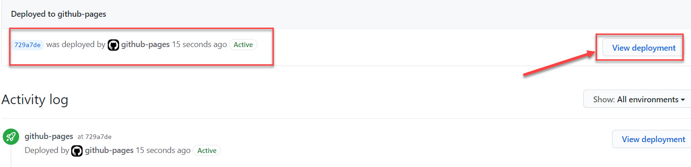

# How to add a file to GitHub Pages?
This is just an example how to quickly add your content in HTML to GitHub Pages in order to obtain a web page. In the next sections you will find out how to work with Markdown files.
1. Open your new repository in VS Code and add a new file.
   
2. Name the file as *index.html*.
3. Write simple content in HTML and **Save** it.

   

4. Open GitHub Desktop Client to add your file to the server.
5. As the name of your file is automatically created select:

    A. **Commit to master**

    B. **Publish branch**.

   

6. To see if you uploaded the file properly, go to your repository on the server.
7. In the bottom right corner of your repository check if the section **Environments** is active.

   

8. To view your deployment select **github-pages** and **view deployment**.

   

9. In the web browser enter your full user's name: *username.github.io* and check if your simple web page works.✌️

   

