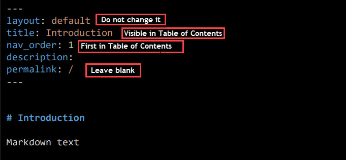

# Static site generators
{: .no_toc}

Static site generator is a software which enables to create a web page from in-built templates. Your content is applied to the template so that you can build your own website. Most static site generators accept files written in Markdown. In this section you will find out what Jekyll is, why it is commonly used and how to work with it.
### Table of contents
{: .no_toc}

1. TOC
{:toc}

## What is Jekyll?
*Jekyll* is a free of charge open source static site generator and a functionality of the GitHub Pages service. Jekyll simply works by applying content of your files created in Markdown to pre-defined tags. As a result, you obtain a website that can be published by any web server. Thus, you can easily manage your projects and focus more on content.

💡 Jekyll is integrated with GitHub for generating GitHub Pages without the need to install Jekyll on your computer.

## How to create a Github Pages site using Jekyll?
### Getting started

1. Open the previously created file *index.html* and rename it into index.md to start working in Markdown.
2. Add content written in Markdown.

   ℹ️ **Tip**: If you already have a markdown file, copy its content to *index.md*.
3. In Github Desktop Client fill in the **Summary** box and perform the standard procedure:
-   **Commit to master**
-   **Push origin**

3. In the server as you sign in to GitHub.com you can see your changed file.
   **📝 Note:** the file *index.md* is your starting point for the formation of the web page.

### Configuring Jekyll
To start working with Jekyll you need to use appropriate template named just-the-docs. You can fully use it only when you make a copy to your repository.

To copy *just-the-docs* template to your repository follow the steps below:
1. In the top left corner on Github.com search for *just-the-docs* repository and open it.

   

2. Copy the repository to your account using the command **fork**.

   

3. In order to save it select :
   
-  **Code** and **Open with GitHub Desktop**.
   
-  **Clone**

   

   **📝 Note:** It is recommended to use the shortest path, for example *C: Git/just-the-docs*, as the repository is to be created inside the folder you selected for your local path.
   
4. Select the option **For my own purposes** when the notification appears.

   

5. As you select **Current repository** in the top left corner check if you  saved just-the-docs template properly in your repository.

   

### How to create a simple site?
1. Open your repository in VS Code.
2. Add *just-the-docs* folder selecting **File** in the top left corner and **Add folder to workspace**.

   

3. Set the structure for your content in your repository.

   
 ℹ️ **Tip**: You can copy existing files from the second repository and adjust its content to your needs.

4. Start with setting: 

- *_config.yml* file as your base.

   

- main *index.md* file.

   

- each chapter or file with appropriate structure included at the top.

   
   
5. As you set the structure and add some content, open Github Desktop Client, fill in the **Summary** box and perform the standard procedure:
-   **Commit to master**
-   **Push origin**

**📝 Note:** It is recommended to save files and make *commits* regularly to check deployments on the server.

6. In the bottom right corner of your repository check if the section **Environments** is active.

   
   
7. To view your deployment select **github-pages** and **view deployment**.

   
   
8. In the web browser enter your full user's name: *username.github.io* and check if your simple web page works.✌️

   

## How to add content to your Github Pages site using Jekyll?

