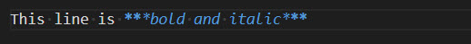

# Markdown Basics
{: .no_toc}

Markdown is a simple markup language that was created to simplify text formatting. Simple tags allow you to bold or italicize words and give them other formatting features defined in HTML.
Below you can find basic syntax to produce your content. For more information use the links below.

### Table of contents
{: .no_toc}

1. TOC
{:toc}

## Elements

|Syntax|Description|
|---| --------------------
|Headers|use # before a header of your document section, for example #H1, ## H2, ### H3|
|Paragraphs|these are one or more lines of written text|
|Lists|list ordered as 1,2,3 or as a bullet list|
|Blockquotes|insert > before every line|
|Links|[ID] (http://example.com/)|
|Emphasis|wrap asterisks (*) and underscores (_) before a word or sentence|
|Images|can be inline or reference, for example: ! [text] (/path/to/img.jpg)|

## Markdown elements in use

### Headings

### Paragraphs
A paragraph does not require special syntax in Markdown. Just several lines of written text.

### Lists

### Blockquotes

### Links
An inline link consists of [text] followed by (file_name).
This is an example of link: [ID] (http://example.com/)

### Emphasis
To format text as **bold**, enclose it in two asteriks.

To format text as *italic*, enclose it in a single asteriks.

To format text as ***bold and italic*** use triple asteriks.

### Images
To insert image, use ![text] followed by (/path/to/img.jpg)

   ℹ️ **Tip**: If an image fails in adding, save either your file or entire workspace.

## More information
[Markdown-help](https://daringfireball.net/projects/markdown/)

[Markdown-tutorial](https://commonmark.org/help/tutorial/index.html)

